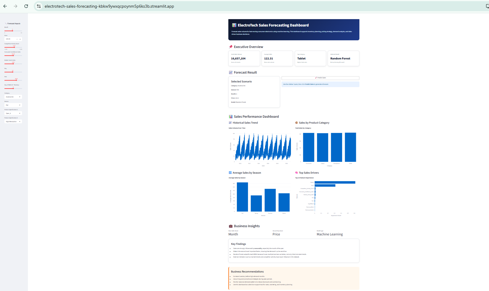
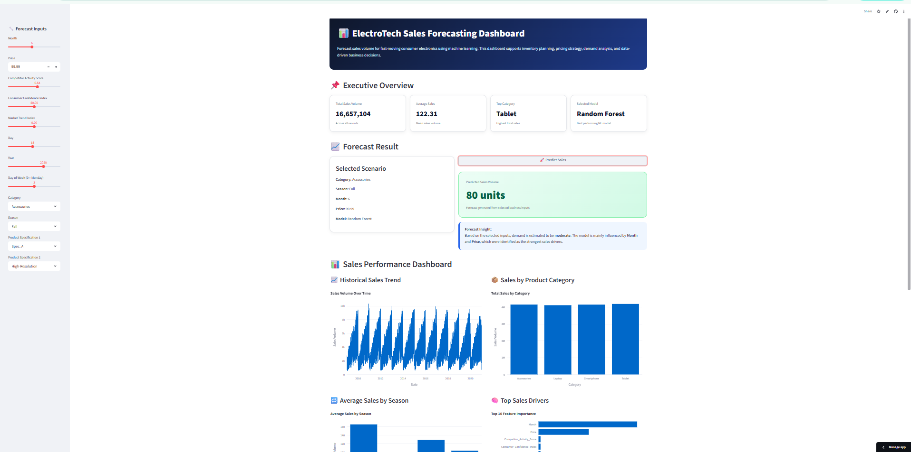
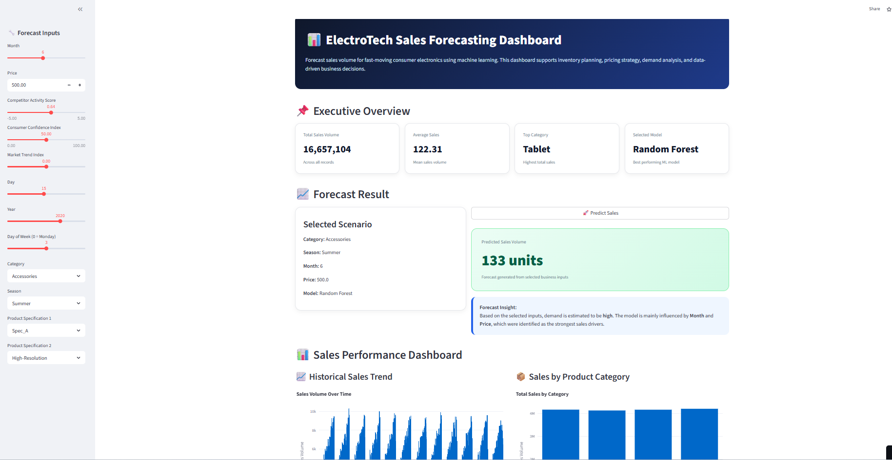
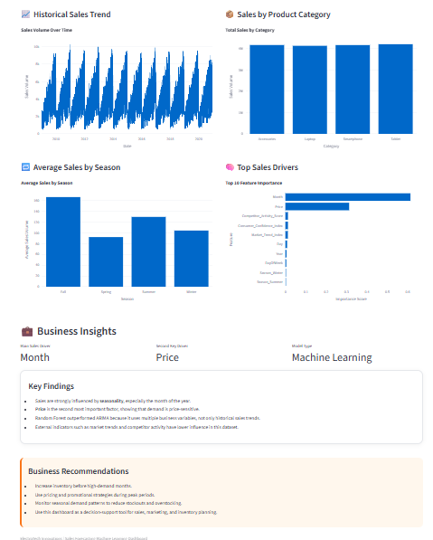

# 📊 ElectroTech Sales Forecasting Dashboard

An end-to-end machine learning sales forecasting dashboard built with Python and Streamlit for analyzing and predicting consumer electronics sales performance.

---

# 🚀 Live Demo

### Streamlit Application
https://electrotech-sales-forecasting-kbkw9ywxqcpoynm5p6ks3b.streamlit.app

### GitHub Repository
https://github.com/Busayosage/electrotech-sales-forecasting

---

# 📌 Project Overview

ElectroTech Sales Forecasting Dashboard is an interactive business intelligence and forecasting platform designed to help organizations analyze historical sales trends and generate predictive sales forecasts using machine learning models.

The system combines:

- Data analysis
- Forecast modeling
- Interactive visualizations
- KPI monitoring
- Business scenario simulation
- Cloud deployment

The dashboard enables users to explore how factors such as pricing, market trends, seasonality, and consumer confidence influence future sales performance.

---

# 🎯 Business Problem

Retail and consumer electronics companies require accurate forecasting systems to support:

- Inventory planning
- Demand forecasting
- Revenue estimation
- Pricing optimization
- Market strategy
- Seasonal sales analysis

Traditional spreadsheet forecasting methods are often limited, static, and difficult to scale.

This project provides a dynamic machine learning-powered forecasting solution with interactive analytics capabilities.

---

# 🧠 Machine Learning Models Used

The project includes multiple forecasting and modeling approaches:

## Random Forest Regressor
Used as the primary predictive forecasting model.

## ARIMA Time Series Forecasting
Used for trend-based time series analysis.

## Regression Modeling
Used during exploratory model experimentation and performance evaluation.

---

# 📈 Dashboard Features

## Executive Overview
- Total sales KPIs
- Average sales metrics
- Top-performing categories
- Model selection summary

## Forecasting Engine
Users can dynamically simulate forecasting scenarios using:

- Month
- Price
- Competitor activity
- Consumer confidence index
- Market trend index
- Seasonality
- Product specifications

## Interactive Visualizations
- Historical sales trends
- Category performance analysis
- Seasonal sales comparison
- Feature importance charts
- Forecast prediction outputs

## Business Insights
The dashboard automatically generates forecasting insights based on selected business conditions.

---

 
# 📸 Dashboard Preview

## Dashboard Overview


---

## Forecast Prediction


---

## Interactive Forecast Inputs


---

## Sales Analytics Visualizations


🏗️ Project Architecture

```text
Raw CSV Dataset
        ↓
Data Cleaning & Preparation
        ↓
Exploratory Data Analysis
        ↓
Feature Engineering
        ↓
Machine Learning Model Training
        ↓
Model Serialization (.pkl)
        ↓
Streamlit Dashboard
        ↓
Cloud Deployment (Streamlit Cloud)
```

---

# 🛠️ Technology Stack

## Programming Language
- Python

## Data Analysis
- Pandas
- NumPy

## Machine Learning
- Scikit-learn
- Statsmodels

## Visualization
- Plotly
- Matplotlib

## Deployment
- Streamlit Cloud
- GitHub

## Development Environment
- Jupyter Notebook
- VS Code

---

# ☁️ Deployment

The application is fully deployed online using:

- GitHub for version control
- Streamlit Cloud for hosting

Deployment workflow:

```text
Local Development
      ↓
GitHub Repository
      ↓
Streamlit Cloud Deployment
      ↓
Public Live Dashboard
```

---

# 📂 Project Structure

```text
electrotech-sales-forecasting/
│
├── data/
│   └── raw/
│
├── notebooks/
│   ├── 01_data_understanding.ipynb
│   ├── 02_data_cleaning.ipynb
│   ├── 03_eda.ipynb
│   ├── 04_modeling.ipynb
│   ├── 05_arima_model.ipynb
│   └── rf_model.pkl
│
├── reports/
│
├── src/
│
├── app.py
├── requirements.txt
├── README.md
└── .gitignore
```

---

# 📊 Key Capabilities

- End-to-end ML pipeline
- Interactive forecasting dashboard
- Cloud-hosted analytics application
- Time series forecasting
- Business intelligence reporting
- Scenario-based prediction system
- Real-time user interaction

---

# 📌 Future Improvements

Future production enhancements may include:

- AWS deployment
- Docker containerization
- CI/CD automation
- Real-time API integration
- Authentication system
- Database integration
- Automated retraining pipeline
- Advanced forecasting models

---

# 👨‍💻 Author

## Oluwabusayomi Seun Oseola

Data Analyst focused on building practical business intelligence, forecasting, and machine learning solutions using Python, analytics, and cloud technologies.

---

# ⭐ Project Status

✅ Completed  
✅ Deployed Live  
✅ Public Portfolio Project  
✅ Cloud Hosted  
✅ Machine Learning Integrated
